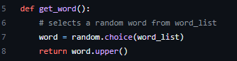
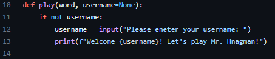
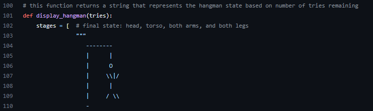
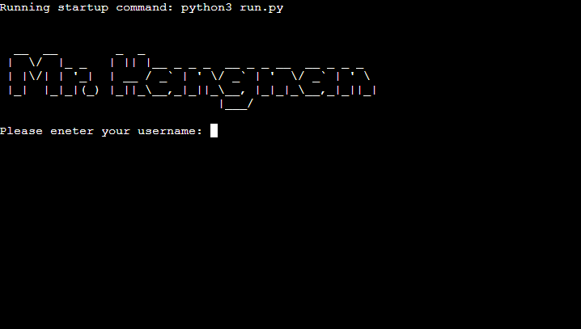
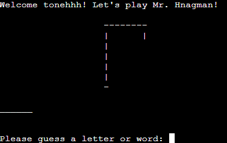
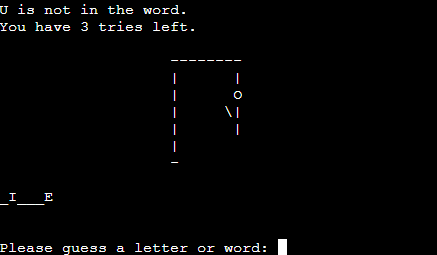
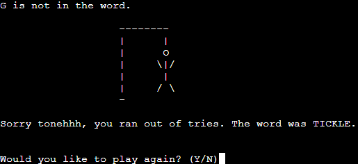
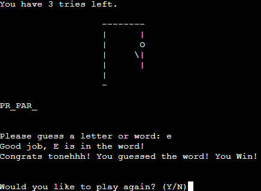

# **Mr. Hangman!**

**"Mr. Hangman"** is based on the classic Hangman game of old but in Python! Mr. Hangman is a word guessing game where the player has to guess a word by suggesting letters one by one but the player has an option to guess an entire word if they feel lucky. The game allows six attempts to guess a letter or whole word before the player loses. If the player fails to guess the word, the game displays a image of a hanged man, hence the name "Hangman"

# Features

### **get_word():**
This function chooses a random word from the list of words provided in words.py.

### **play(word, username=None):** 
This function is the main game loop. It takes a username parameter, which is the player's name. If the username is not provided, the game will default to **'None'**. The function initializes the game state and displays the welcome message along with the initial state of the game. The player is then prompted to enter a letter or the whole word. The game checks whether the input is a letter or a word and updates the game state accordingly. If the player guesses the word, the game congratulates the player and asks if they want to play again. If the player runs out of attempts, the game displays the hanged man and reveals the correct word.

### **display_hangman(tries):**
This function returns a string that represents the hangman state based on the number of attempts remaining.

# **The Game**

- Players are greeted with the title of "Mr. Hangman" and are promt to enter a username before starting the game.

- After the input of the username is made, the game starts prompting the player to guess a letter or word while also welcoming the player with the username they entered.

- As the player goes on with their guesses, correct letter guesses will be displayed in uppercase where the secret word is located and with each wrong guess made, the game will display it above with the remaining tries the player has left.

- When the player has exhuasted all their tries and fails to complete the word, a message will be displayed telling the player that they ran out of tries and reveal the secret word while also displaying the full state of the Hangman. An accompanying message will also be displayed asking for a prompt from the player whether they want to play again or not.

- However, if the player guesses all the letters or guesses the word correctly, they'll recieve a message that they've won the game and are asked again if they want to continue playing or not.

# **Testing**

I manually tested this project by the follwoing:

- Passed the code through the CI PEP8 Linter with no severe problems.
- Ran through the game several times to see any unwanted bugs pop up, all clear now.
- Tested in both the local terminal and CI Heroku terminal.

## **Bugs**

### **Solved Bugs**

- When I first tried out the game, it kept asking me to input a new username after every win/lose scenario which is not what I wanted. I figured out the issue was placing the input function in **def main():** was the cause, so I relocated the function to the **def play():** instead and it fixed the problem.

### **Remaining Bugs**

- No bugs remaining.

### **Deployment**
This project was deployed using Code Institutes Mock Terminal for Heroku.
- Steps taken for Deployment
    - Fork or clone the repository.
    - Created a new Heroku app.
    - Set the buildbacks to **Python** and **NodeJS** in that order.
    - Linked the Heroku app to the repository.
    - Clicked **Deploy**.

### Credits

- Code Institute for the deployment terminal.
- Inspiration from freeCodeCamps Hangman [tutorial](https://www.youtube.com/watch?v=8ext9G7xspg&t=1465s).